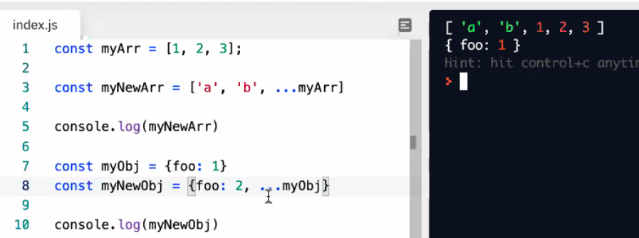

# DAY 04 NOTES

## REVIEW

**Framework** - someone elses code we can use but with a bunch of "rules". You have to write the code in a certain way.

**Library** - A bunch of little tools for doing what you need. 

**Class** - lets use use CRUD verbs to interact with our in-memory db

**Spreading**

Using spread will reassign the value of a key if it is given another that matches.



```
const dbObj = this.db.find(record => record.id === id);
dbObj = {...dbObj, ...obj};
return dbObj;
```

//:::::::::::: ::::::::::::: ::::::::::::::: ::::::::::::::

**SQL**
- Tables
- Relational
- Columns
- Rigid Structure
- Spreadsheet
- RECORD

**NoSqQL**
- Non-relational DB
- You can have missing data
- COLLECTIONS
```
[{foo:1}, {bar:2},{},{}]
``` 
- Resembles JSON Docs
- Harder to search for what you want..

##MONGO DB

**Mongoose** - Wraps around Mongo and lets us interact with it more easily. Kind of like a framework? It makes it wayy easier to communicate.
- "hey mongoose, do all this stuff, translate my requests and give them to Mongo!"

- needs to be installed as `npm i mongoose`
- remember to install `npm i supergoose`

- [mongoose docs](https://mongoosejs.com/docs/)

1. Create schema

```
const kittySchema = new mongoose.Schema({
  name: string
  };)
```

2. Make a model (how we interact with our collection)

```
const Kitten = mongoose.model('kitten', kittySchema);
///make new entry in db
const silence = new Kitten ({name:'oii'});
silence.save().then(()=>console.log(''meow'));

```
### Deploying to Heroku With a Mongo DB

[Mongo DB Atlas](https://www.mongodb.com/cloud/atlas/efficiency?utm_source=google&utm_campaign=gs_americas_united_states_search_brand_atlas_desktop&utm_term=mongo%20db%20atlas&utm_medium=cpc_paid_search&utm_ad=e&utm_ad_campaign_id=1718986498&gclid=CjwKCAiAq8f-BRBtEiwAGr3DgUjgwlV2YCFz83xtkaq-toSDVI-oB6O2VC8zFa_fnM-1VF8suLaVNhoCJxMQAvD_BwE)

MONGOOSE_URI

